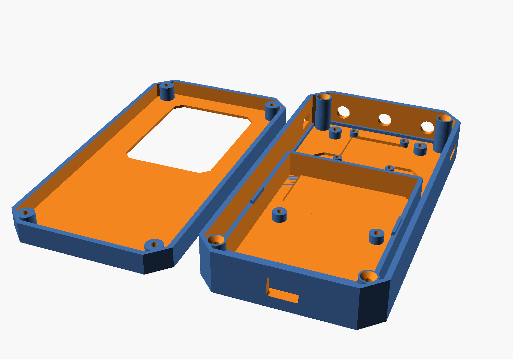
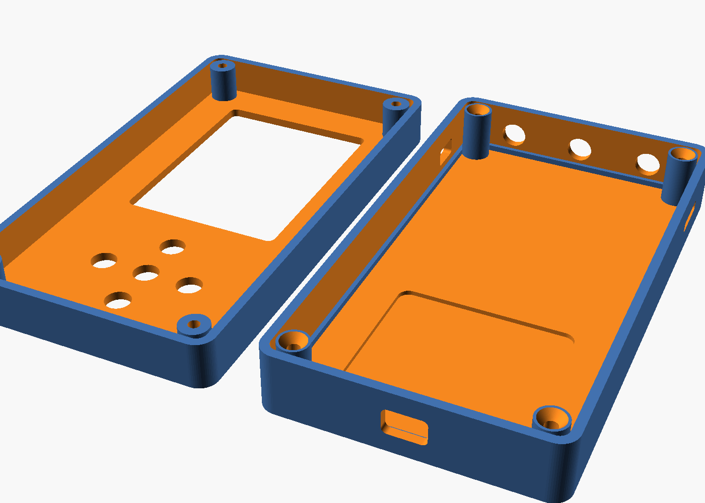

# باکس پرینت سه‌بعدی ESP32-DIV V2

دو طرح داری:

| طرح | فایل‌ها | توضیح |
|---|---|---|
| **Tactical (پیشنهادی)** | `enclosure_tactical.scad` + `tactical_front.stl` + `tactical_back.stl` | ظاهر تاکتیکال (لبه‌های زاویه‌دار/فاست)، **بدون دکمه** (فقط تاچ)، جای مشخص **باتری ۶۰×۸۰**، استندآف برد، جای ماژول رادار، و ناحیه‌ی آنتن PN5180 |
| ساده (نسخه‌ی اول) | `enclosure.scad` + `front.stl` + `back.stl` | نسخه‌ی گرد و دکمه‌دار اولیه |



## ⚠️ نکته‌ی مهم درباره‌ی چیدمان داخلی
در طرح تاکتیکال، **جای باتری و استندآف بردها در حالت پیش‌فرض هم‌پوشانی دارند** — چون
باتری و برد باید در **عمق** روی هم بنشینند (باتری در نیمه‌ی پشت، برد روی استندآف بلندتر
یا روی پوسته‌ی جلو). این عمدی و پارامتریک است: با ابعاد واقعی بردهایت،
`pcb_center_dy`، `standoff_h` و موقعیت باتری را تنظیم کن. حتماً اول draft بگیر.

همچنین محلِ کویل RFID و رادار نباید مستقیماً پشت باتری یا صفحه‌ی زمین برد باشد.

---

## نسخه‌ی ساده (مرجع)

فایل منبع `enclosure.scad` (OpenSCAD) و دو فایل `front.stl` و `back.stl`.



- **front.stl** — رویه‌ی جلو: پنجره‌ی نمایشگر ۲.۸ اینچ + پنج سوراخ دکمه (کراس D-pad + select) + چهار بوش پیچ گوشه
- **back.stl** — رویه‌ی پشت: محفظه‌ی باتری/بردها، سوراخ آنتن SMA (بالا)، USB-C (پایین)،
  اسلات microSD (راست)، کلید پاور (چپ)، لبه‌ی قفل‌شونده، و **ناحیه‌ی نازک RFID** برای
  کوپلینگ بهتر کویل PN532

## ⚠️ قبل از چاپ حتماً بخوان

ابعاد پیش‌فرض بر اساس ماژول نمایشگر ۲.۸ اینچ و یک حجم داخلی معقول است، **نه** روی
اندازه‌گیری دقیق بردهای تو. حتماً:
1. ابعاد برد اصلی، شیلد، و ضخامت استک (با کانکتورها) را اندازه بگیر.
2. پارامترهای بالای `enclosure.scad` را تنظیم کن.
3. اول یک نمونه‌ی سریع (draft) بگیر و جای پورت‌ها/دکمه‌ها را چک کن.

## پارامترهای کلیدی (بالای فایل `.scad`)

| پارامتر | پیش‌فرض | توضیح |
|---|---|---|
| `ext_w`, `ext_h` | 74, 132 | عرض و ارتفاع بیرونی |
| `total_depth` / `front_depth` | 30 / 13 | عمق کل و عمق نیمه‌ی جلو |
| `wall` | 2.4 | ضخامت دیواره |
| `screen_w`, `screen_h` | 46, 61 | پنجره‌ی نمایشگر (کمی بزرگ‌تر از ناحیه‌ی فعال ۴۳.۲×۵۷.۶) |
| `screen_off_top` | 11 | فاصله‌ی پنجره از بالا |
| `btn_d`, `btn_pitch` | 7, 13 | قطر و فاصله‌ی دکمه‌ها |
| `usb_*`, `sd_*`, `sw_*`, `ant_*` | — | جای پورت‌ها، اسلات SD، کلید، و سوراخ‌های آنتن |
| `rfid_zone_*`, `rfid_wall` | —، 1.2 | ناحیه و ضخامت نازک روی کویل RFID |
| `boss_*`, `lip_*` | — | بوش پیچ گوشه و لبه‌ی قفل |

## بازتولید STL از منبع

```bash
openscad -D 'part="front"' -o front.stl enclosure.scad
openscad -D 'part="back"'  -o back.stl  enclosure.scad
# پیش‌نما:
openscad -D 'part="both"' --imgsize=1400,1000 --camera=0,0,0,55,0,25,340 -o preview.png enclosure.scad
```

## تنظیمات پیشنهادی چاپ

- متریال: **PETG** (مقاوم‌تر و کمی نرم برای دکمه‌ها) یا PLA
- ارتفاع لایه: ۰.۲ mm، پریمتر: ۳، اینفیل: ۲۰–۳۰٪
- ساپورت: **لازم نیست** اگر جلو را با رویه به پایین و پشت را با دهانه به بالا بچاپی
- جهت: پنجره‌ی نمایشگر رو به صفحه‌ی چاپ (سطح صاف و تمیز)

## مونتاژ

- ۴ پیچ **خودکار M2.5** از پشت داخل بوش‌های جلو (سوراخ پایلوت ۱.۵mm در جلو، سوراخ
  کلیرنس + خزینه در پشت).
- کویل PN532 را از داخل، دقیقاً پشتِ **ناحیه‌ی RFID** (بخش نازک ۱.۲mm) بچسبان تا
  بیشترین برد ممکن را بدهد.
- برای دکمه‌ها می‌توانی از پلانجرهای چاپی جدا یا مستقیم روی تک‌سوییچ‌ها استفاده کنی.
